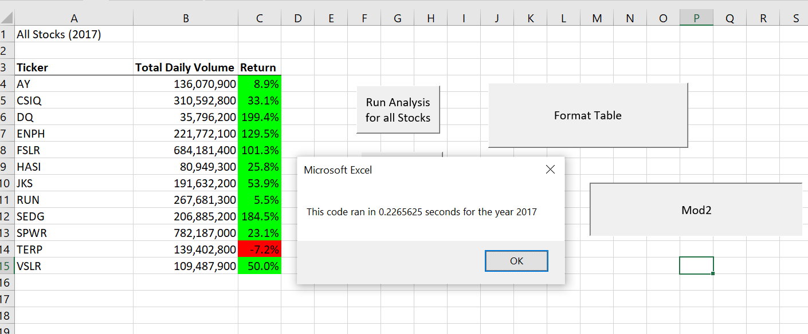
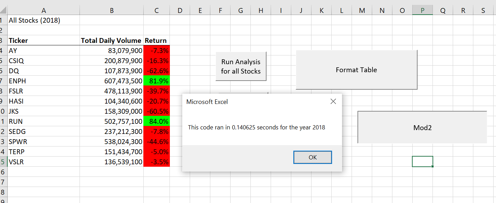

# Module 2 Challenge - VBA

## The Purpose:

###   The purpose of the project was to compare runtimes for two VBA codes
###   using the same dataset to display the same results.

Click [here](/VBA_Challenge.xlsm) to view the Excel Workbook.

#### The datasets (2017 and 2018) included 8 columns and 3013 rows for data from 12 different stocks.
#### Our task was to analyze Volume and Return for a specific year.
#### This was done by writing VBA code to loop through the rows and calculate and display the results for each stock.
#### After writing the original code to loop through the data 12 times, we refactored the code to loop through once and output the results to arrays.
#### Below are the results and summary of the findings along with screenshots of the results.

## The Results:

###   Refactored Code

####    The refactored code looped through 3013 rows **ONCE** to gather the data.
####    The refactored code stored data in arrays before displaying outcomes.

####    2017: 0.2265625 seconds runtime.

####    2018: 0.140625 seconds runtime.

###   Original Code

####    The original code looped through 3013 rows twelve times to gather the data.
####    The original code output data for each ticker before looping through entire dataset again.

####    2017: 0.6132813 seconds runtime.

####    2018: 0.6367188 seconds runtime.

## The Summary:

###   Advantage for the refactored code:
####    Faster runtimes.  The 2017 refactored code was 2.71 times faster.  The 2018 refactored code was 4.53 times faster.
###   Disadvantage for the refactored code:
####    Time spent writing code a second time.

###   Advantage for the original code:
####    Only had to be written once.
###   Disadvantage for the original code:
####    Slower runtimes.
